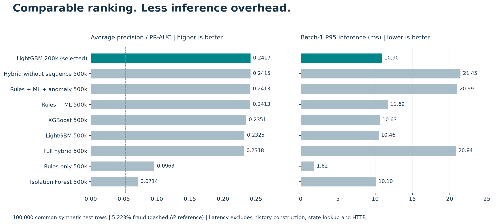
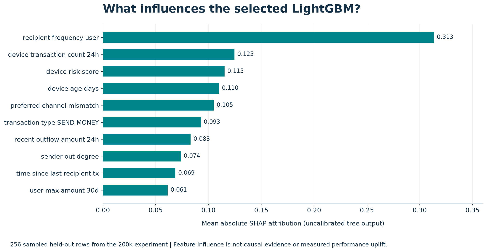
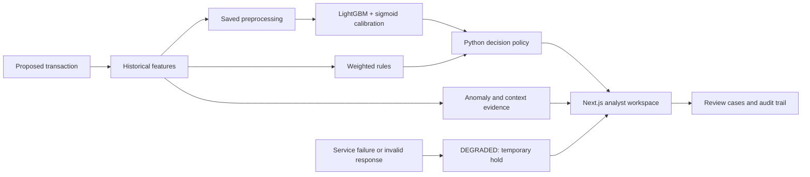

# MFS Guard

**Spot suspicious transfers. Explain the evidence. Support analyst decisions.**

[Live demo](https://mfs-fraud-detection-system.vercel.app) · [Model findings PDF](output/pdf/MFS_Guard_Model_Findings_Judges.pdf) · [Model selection](mfs-guard-ml/reports/final_model_selection.md) · [API reference](docs/api.md)

A Mobile Financial Services fraud detection workspace built with **Next.js, React, TypeScript, PostgreSQL and a Python LightGBM scoring service**. Built for **Track 01: Trust & Risk Intelligence** of DIU CPC × upay AI Hackathon 2026.

> All reported model results use synthetic data. They demonstrate a reproducible prototype, not real upay production performance. Live demo scoring requires a reachable Python service; offline benchmarks do not measure the complete app policy.

## Selected model: calibrated LightGBM

We use **LightGBM_200k-v1**, with **140 boosted trees, 130 input features and sigmoid probability calibration**. The 200k name refers to the full experiment: the base estimator fits its chronological **140k training block**, with remaining rows reserved for validation and testing.

| Common-test PR-AUC | Precision | Recall | Flagged transactions | Prepared-frame P95 |
| --- | --- | --- | --- | --- |
| **0.2417** | **36.99%** | **29.06%** | **4.10%** | **10.90 ms** |

Precision, recall and flagged share use the **validation-selected threshold 0.20516681**. On the common test, this catches **1,518** fraud cases, misses **3,705**, and flags **2,586** legitimate transactions. Model choice balances ranking quality, serving complexity and interruption volume.

## Model comparison



All models below score the **same 100,000 fresh synthetic transactions**, including **5,223 fraud cases**, generated with seed 2026. PR-AUC is reported as **average precision**. Threshold-dependent metrics use each model's own maximum-validation-F1 threshold.

| Model / training experiment | PR-AUC ↑ | Precision ↑ | Recall ↑ | F1 ↑ | Flagged share | P95 ms ↓ |
| --- | ---: | ---: | ---: | ---: | ---: | ---: |
| **LightGBM 200k — selected** | **0.2417** | **36.99%** | **29.06%** | **0.3255** | **4.10%** | **10.90** |
| Hybrid without sequence 500k | 0.2415 | 36.58% | 30.17% | 0.3307 | 4.31% | 21.45 |
| Rules + ML + anomaly 500k | 0.2413 | 37.43% | 28.49% | 0.3235 | 3.98% | 20.99 |
| Rules + ML 500k | 0.2413 | 37.36% | 28.43% | 0.3229 | 3.98% | 11.69 |
| XGBoost 500k | 0.2351 | 37.31% | 28.05% | 0.3202 | 3.93% | 10.63 |
| LightGBM 500k | 0.2325 | 35.31% | 32.80% | 0.3401 | 4.85% | 10.46 |
| Full hybrid 500k | 0.2318 | 35.69% | 31.19% | 0.3329 | 4.56% | 20.84 |
| Rules only 500k | 0.0963 | 15.06% | 22.59% | 0.1807 | 7.84% | 1.82 |
| Isolation Forest 500k | 0.0714 | 9.07% | 20.68% | 0.1261 | 11.90% | 10.10 |

**Why LightGBM?** Its ranking quality is close to the strongest hybrid with substantially lower inference overhead. The hybrid has slightly higher recall and F1 at its selected threshold, and LightGBM 500k has higher recall still; the selected model does not win every metric.

### Measured improvement factors

| Comparison | Measured improvement | Interpretation |
| --- | --- | --- |
| LightGBM vs rules only: PR-AUC | **2.51×** (0.2417 / 0.0963) | Better ranking on the common test |
| LightGBM vs rules only: precision | **2.46×** (36.99% / 15.06%) | At their different validation-selected operating points |
| LightGBM vs rules only: false-positive rate | **61.1% lower** (2.73% vs 7.02%) | Relative reduction at those operating points |
| LightGBM vs hybrid without sequence: P95 | **1.97× faster** (21.45 / 10.90 ms) | Prepared-frame inference only |
| LightGBM vs hybrid without sequence: saved bundle | **18.03× smaller** (2.037 / 0.113 MiB) | Experiment bundle, not the full deployed service |

The hybrid-minus-LightGBM PR-AUC difference is **−0.000157**, with a paired 95% interval of **[−0.006239, +0.005098]**. This does not establish a ranking advantage for either model. Intervals use 1,000 UTC-day bootstrap resamples and do not capture training-seed variance. Latency includes preprocessing and calibration but excludes historical-state retrieval, feature construction and HTTP.

Sources: [comparison CSV](mfs-guard-ml/results/final_common_test/model_comparison.csv), [confidence intervals](mfs-guard-ml/results/final_common_test/confidence_intervals.csv), [latency measurements](mfs-guard-ml/results/final_common_test/latency_comparison.csv).

## Which factors help detection?



The model combines transaction context with earlier account, device, recipient and network history. The chart shows **feature influence**, not how much accuracy would improve by adding each feature.

| Signal family | Examples | Evidence and scope |
| --- | --- | --- |
| Recipient familiarity | Prior recipient frequency; time since last transfer | Recipient frequency has the highest sampled mean absolute SHAP attribution |
| Device behavior | Device transaction count, risk score and age | Three of the top four sampled attribution features |
| Personal behavior and cash flow | Preferred-channel mismatch; recent outflow; user maximum amount | Compares a proposed transfer with earlier customer activity |
| Graph relationships | Sender out-degree; shared recipients; mule-network score | Graph-removal uplift is inconclusive in the earlier ablation |
| Event sequences | Credential/device changes followed by transfers | Earlier 500k retraining ablation: **+0.0055 AP**, 95% CI **[+0.0018, +0.0100]** |
| Supporting anomaly layer | Isolation Forest behavioral deviation | Earlier 500k full-hybrid vs no-anomaly ablation: **+0.0043 AP**, CI **[+0.0015, +0.0070]** |

SHAP uses **256 sampled held-out rows from the earlier 200k experiment** and explains uncalibrated tree output. The ablations use the earlier 500k temporal test, not the common final test; their effects are not additive and do not prove that a full hybrid outperforms selected LightGBM. Isolation Forest supplies separate evidence, not part of the standalone LightGBM probability.

Sources: [SHAP values](mfs-guard-ml/results/200k/shap_feature_importance.csv), [explanation scope](mfs-guard-ml/results/200k/explainability_scope.json), [ablation findings](mfs-guard-ml/reports/final_report.md).

### What still needs improvement

- **Subtle, velocity and agent fraud:** selected-threshold recall is only **0.99%, 0.98% and 1.62%**, respectively. Account-takeover recall is stronger at **65.94%**. Prioritize realistic examples and richer history for weak categories.
- **Threshold choice:** lowering the threshold to the saved cost reference **0.03734065** increases recall to **70.69%**, but flags **33.18%** of transactions with **11.13%** precision. Choose using actual review capacity and costs, not recall alone.
- **Generalization:** repeat training seeds, freeze the model and policy before another untouched holdout, and validate on de-identified real event histories with delayed investigation labels.
- **Serving:** the prototype replays capped history per request. An incremental history store and full-request benchmarks are needed to establish production behavior.

These are improvement priorities, not measured future gains. See [fraud-type results](mfs-guard-ml/results/final_common_test/fraud_type_performance.csv) and [threshold comparisons](mfs-guard-ml/results/final_common_test/threshold_comparison.csv).

## How screening works



The Python service combines calibrated ML bands with rule bands, choosing the more severe action. Blacklists or the combined high-ML/high-rule condition can produce rejection. Next.js uses the returned decision and displays evidence separately.

| ML probability band | ML action before rule escalation |
| --- | --- |
| Below 0.082229 | `APPROVE` |
| 0.082229 to below 0.205167 | `APPROVE_AND_MONITOR` |
| 0.205167 to below 0.445 | `STEP_UP_AUTH` |
| 0.445 and above | `TEMPORARY_HOLD` |

Thresholds come from validation data. Rounded boundaries above summarize the [exact saved policy](mfs-guard-ml/backend/models/final/thresholds.json). Model probabilities, rule scores and anomaly scores are different quantities. Consequential actions record recommendations for human review.

The client defaults to `http://127.0.0.1:8000`, configurable with `MFS_ML_SERVICE_URL`. If the service is unreachable or its response fails validation, Next.js marks the transaction `DEGRADED` and assigns `TEMPORARY_HOLD`. The standalone Python service also has its own rules-based degraded path; this differs from the client's handling of a failed request. See [client integration](src/lib/ml.ts) and [backend policy](mfs-guard-ml/backend/app/services/decision_engine.py).

## What works today

- Calibrated LightGBM scoring, saved model versions, SHAP factors and 19 exported research rules; the analyst workspace also maintains its configurable rule policy.
- Dashboard, transaction simulator, alerts, case reviews, entity history and CSV export.
- Saved decision evidence, policy snapshots, analyst notes and audit trails.
- Template-based investigation briefs summarizing saved evidence and next actions.
- Review metrics: reviewed-alert precision, false-positive reviews, coverage, first-review time, confirmed fraud exposure and channel review rates.
- Separate TypeScript account-level anomaly analysis and a Python Isolation Forest supporting layer. Anomaly scores are not fraud probabilities; cold-start coverage is limited.

## Quick start

Requires **Node.js 22+** and a compatible Python environment for the saved ML artifacts. Install the pinned [Python dependencies](mfs-guard-ml/requirements.txt). These commands use Windows PowerShell.

**Terminal 1 — scoring service:**

```powershell
cd mfs-guard-ml
python -m venv .venv
.\.venv\Scripts\python -m pip install -r requirements.txt
.\.venv\Scripts\python -m uvicorn backend.app.main:app --port 8000
```

**Terminal 2 — repository root:**

```powershell
npm ci
npm run dev
```

Open [localhost:3000](http://localhost:3000). On macOS/Linux, use `.venv/bin/python` instead of `.venv\Scripts\python`. Existing compatible environments can skip creation and installation.

Public demo mode is enabled in `deployment.config.json`; the web demo does not require a database, password or session secret. Synthetic activity is stored in server memory and may reset or differ between instances. A hosted deployment needs a reachable scoring service URL: its `127.0.0.1` cannot reach your laptop's Python server.

## Evaluation and reproducibility

The ML study covers **100k–500k** generated datasets. Each uses **70% train / 15% validation / 15% temporal test**. Validation is divided into five disjoint blocks for tuning, fusion, calibration, selection and thresholds. Preprocessing is fitted on training rows; historical features are computed before current-event updates.

The common final test uses fresh seed-2026 histories and includes cold starts. Per-scale temporal tests instead contain returning customers, so their scores are not directly interchangeable. See the [ML README](mfs-guard-ml/README.md), [dataset card](mfs-guard-ml/reports/final_test_dataset_card.md) and [all-scale comparison](mfs-guard-ml/results/final/all_model_results.csv).

```powershell
npm test
npm run typecheck
npm run evaluate
python scripts/generate_readme_figures.py
```

`npm run evaluate` runs the separate TypeScript rules/anomaly benchmark; it does **not** reproduce the LightGBM comparison above. The figure script redraws the README images from saved CSVs and requires Matplotlib; it does not retrain models.

## API

Workflow JSON endpoints use the analyst session cookie and start at `/api/v1`.

| Method | Endpoint | Purpose |
| --- | --- | --- |
| POST / DELETE | `/api/auth` | Sign in / sign out |
| POST | `/api/v1/transactions/analyze` | Screen and save a transaction |
| GET | `/api/v1/transactions`, `/api/v1/transactions/{id}` | History and decision evidence |
| GET / PATCH | `/api/v1/alerts/{id}` | View or update an alert |
| POST | `/api/v1/cases/{id}/review` | Review and analyst notes |
| GET / POST | `/api/v1/rules` | List or create rules |
| PATCH | `/api/v1/rules/{code}` | Update a rule |
| GET | `/api/v1/dashboard/summary`, `/api/v1/audit` | Dashboard metrics and audit history |

See the [API reference](docs/api.md) for payloads, responses and all endpoints.

## Documentation

- [Model findings PDF](output/pdf/MFS_Guard_Model_Findings_Judges.pdf) — judge-facing report, charts and technical appendices; serving behavior is a point-in-time snapshot.
- [Final model selection](mfs-guard-ml/reports/final_model_selection.md) — common-test results and rationale.
- [Architecture](docs/architecture.md) — scoring, storage and authentication.
- [Demo scenarios](docs/demo-scenarios.md) — sample transactions and expected decisions.
- [Hackathon playbook](docs/hackathon-playbook.md) — demonstration and validation guidance.
- [Implementation plan](IMPLEMENTATION_PLAN.md) — system design and roadmap.
